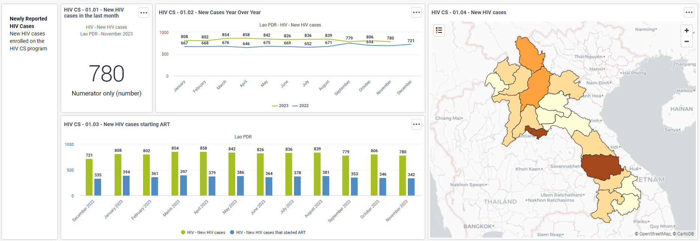
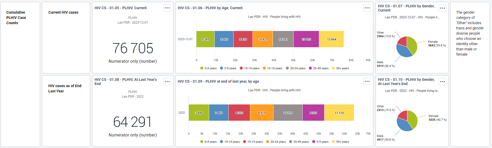

## Case Surveillance Dashboards & Datasets

### Case Surveillance Dashboards

Thematic dashboards for monitoring various aspects of HIV care and treatment programming have been developed based on the core indicators included in WHO’s 2022 [*Consolidated guidelines on person-centred HIV strategic information*](https://www.who.int/publications/i/item/9789240055315). Standard dashboard visualizations developed with WHO’s guidance can be rendered at national or sub-national levels depending on user configuration.

Dashboards are served entirely by DHIS2 *indicators* as described in the next section. The following dashboards are available for routine analysis of HIV prevention activities.

#### HIV CS - 01. Case surveillance

Volume of new HIV cases diagnosed during the current and previous year and the ones that have started ART

PLHIV in the current and at the end of the previous year disaggregated by age and gener

New HIV cases by probable route of transmission and PMTCT indicators

New HIV cases by Key Popualtion groups

[New HIV cases by key population groups](resources/images/key_population.png.)

#### HIV CS - 02. ART initiation, retention and viral suppression

PLHIV on ART by months of the current year and geographical distribution

[PLHIV on ART](resources/images/plhiv_art.png.)

Linkage to ART at diagnosis, within 7 days and late ART initiation by period and organisation unit

[Linakge to ART and late ART initiation](resources/images/linkage_art_late_initiation.png.)

ART retention and treatment status up to today

[ART retention and treatment status](resources/images/art_retention_treatment_status.png.)

Total attrition from ART by months and organisation unit

[Total attrition from ART](resources/images/total_attrition_art.png.)

AIDS-related deaths details by perido and organisation unit

[AIDS mortality](resources/images/aids_mortality.png.)

Viral load testing coverage and PLHIV on ART with suppressed viral load

[Viral load test coverage and PLHIV with suppressed viral load](resources/images/vl_coverage_suppressedty.png.)

Early viral load testing by period and organisation units

[Early viral load testing](resources/images/early_viral_load_testing.png.)

#### HIV CS - 03. DSD ART

Multi-monthly ART dispensing 

[Multi-monthly ART dispensing](resources/images/multi_month_art.png.)

DSD ART models eligibility and enrollment 

[DSD ART eligibility and enrollment](resources/images/dsd_eligibility_enrollment.png.)

#### HIV CS - 04. HIV/TB

TPT initiation and completion

[TPT initiation and completion](resources/images/tpt_initiation_completion.png.)

TB screening and diagnostic cascade considered priority for high burden HIV/TB settings

[TB screening and diagnostic cascade](resources/images/tb_screening_diagnostic_cascade.png.)

#### HIV CS - 05. Epidemic Status

Visualisation for the three pilars (3 95%) and their performance during the time

[Three 95 pillars](resources/images/hiv_pillars.png.)

#### HIV CS - 06. STI

Syphilis testing and treatment coverage over the time and organisation units

[Syphilis testing coverage](resources/images/syphilis_testing_coverage.png.)
[Syphilis test positivity and treatment coverage](resources/images/syphilis_test_positivity_treatment.png.)

Gonorrhoea testing and treatment coverage over the time and organisation units

[Gonorrhoea testing coverage](resources/images/gonorrhoea_testing_coverage.png.)
[Gonorrhoea test positivity and treatment coverage](resources/images/gonorrhoea_test_positivity_treatment.png.)

Presence of STI syndrome and repeat diagnosis of same STI syndrome within 12 months

[STI syndrome](resources/images/sti_syndrome.png.)

#### HIV CS - 07. Viral hepatitis

HBV test, positivity and treatment coverage by period and organisation units

[HBV](resources/images/hbv.png.)

HCV test, positivity, treatment coveragea and cured by period and organisation units

[HCV](resources/images/hcv.png.)

#### HIV CS - 08. Cervical cancer

Cervical cancer screening coverage, outputs and treatment

[Cervical cancer](resources/images/cervical_cancer.png.)
