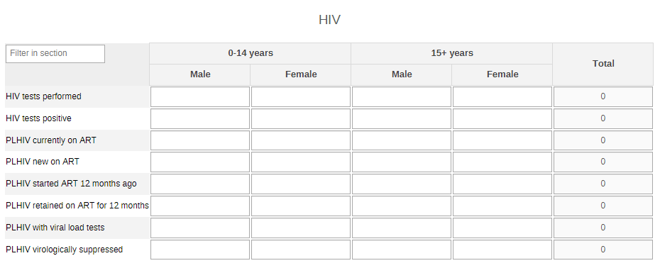
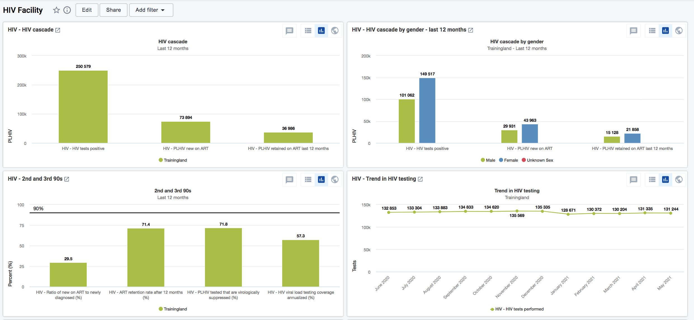

# HIV HMIS System Design { #hiv-agg-design-120 }

Version 1.2.0

## Introduction

This document describes the conceptual system design in DHIS2 for the HIV configuration package for aggregate reporting. The package is designed to facilitate the capture and analysis of a core set of indicators through routine health management information systems (HMIS) as described in the [WHO Analysis and Use of Health Facility Data Guidance for HIV Programme Managers](https://cdn.who.int/media/docs/default-source/documents/ddi/facilityanalysisguide-hiv.pdf) (2019).

The HIV package includes two main components:

1. Aggregate data reporting component (data set, data elements, category combinations for required disaggregation, etc).
2. Dashboard component: focusing on how the data collection part of the configuration has been designed in DHIS2 (i.e. data sets and data elements).

This document is intended for use by DHIS2 implementers at country and regional level to be able to support implementation and localization of the configuration package while adhering to the design principles set forth.

## Data Sets

The HIV configuration package for aggregate reporting contains the following datasets for entering input data as summarized below;

| Name | Periodicity | Purpose |
| --- | --- | --- |
| HIV Monthly | Monthly | Reporting of health facility data related to HIV testing, treatment and viral load suppression |
| HIV annual data | Annual | Captures estimated number of people living with HIV |

## Data Set Sections

This section will present the main sections (tables) of the datasets (reporting forms), explaining their configuration.

### HIV Section

This section covers the general HIV testing, treatment and viral suppression and it has been configured with data elements using a disaggregation for age (0-14 yrs, 15+yrs) and Sex (Male, Female) with the totals automatically computer in the process of data entry.

### PMTCT Section

This section covers the PMTCT with ANC testing and treatment and it has been configured with data elements that are not disaggregated as the guidelines.

#### Data Elements

These are the data elements in the used to create the dataSets above and also to configure the indicators. They broadly cover; testing, treatment, retention, viral suppression, PMTCT and estimated PLHIV. The full list for data elements is available in the [Reference file](resources/metadata.xslsx) for the HIV aggregate package.

### Validation Rules

The full list of validation rules is available in the [Reference file](resources/metadata.xslsx).

## Indicators

Indicators are aligned to the core indicator list contained in the [WHO Analysis and Use of Health Facility Data Guidance for HIV Programme Managers](https://www.who.int/healthinfo/FacilityAnalysisGuide_HIV.pdf?ua=1). These indicators facilitate analysis of testing, treatment, viral suppression, and with a component of PMTCT. For TB indicators related to PLHIV, see the [WHO Analysis and Use of Health Facility Data Guidance for TB Programme Managers](https://www.who.int/healthinfo/FacilityAnalysisGuide_TB.pdf?ua=1).

The full list of indicators is available in the [Reference file](resources/metadata.xslsx).

## Tracker to Aggregate

Transferring aggregated tracker domain data to aggregate domain data values - In addition to the metadata provided above, implementations will require a mechanism to push the program indicator values from the tracker domain to the target aggregate data set. More information about this can be found in this chapter of the [DHIS2 Implementation Guide: Integrating Tracker and Aggregate Data](https://docs.dhis2.org/en/implement/maintenance-and-use/tracker-and-aggregate-data-integration.html#how-to-saving-aggregated-tracker-data-as-aggregate-data-values)

## Dashboard

Dashboard items (charts, maps and pivot table) are aligned to the [WHO Analysis and Use of Health Facility Data Guidance for HIV Programme Managers](https://cdn.who.int/media/docs/default-source/documents/ddi/facilityanalysisguide-hiv.pdf) and designed for national, subnational (district) and facility level analysis.

### HIV Burden

This is national and subnational level dashboard that shows HIV burden estimate analysis with all items using maps to present the data on HIV estimates (Population, PLPHIV, and HIV).

### HIV National

 This is national level dashboard that shows HIV cascade, 2nd and 3rd 90 indicators, ART coverage, HIV testing, treatment and viral suppression analysis using the charts, pivot tables and maps to present the data.

### HIV District (SNU2)

This is sub national level dashboard that shows HIV cascade, 2nd and 3rd 90 indicators, ART coverage, HIV testing, treatment and viral suppression analysis using the charts, pivot tables and maps to present the data.

### HIV Facility

This is facility level dashboard that shows clinical HIV cascade, 2nd and 3rd 90 indicators, HIV testing, treatment and viral suppression analysis using the charts and pivot tables to present the data.

## References

1. [WHO Analysis and Use of Health Facility Data Guidance for HIV Programme Managers](https://cdn.who.int/media/docs/default-source/documents/ddi/facilityanalysisguide-hiv.pdf)  (March 2019)
2. WHO toolkit for analysis and use of health facility data, accessed at: [https://www.who.int/healthinfo/tools\_data\_analysis\_routine\_facility/en/](https://www.who.int/healthinfo/tools_data_analysis_routine_facility/en/)
